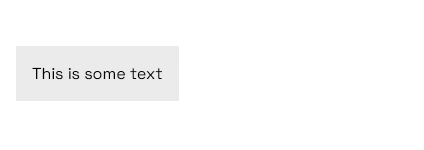

# 🖱️ Click Outside



## Overview

The click outside directive allows you to run a method when a user clicks outside the element that you attach the directive to.

Directives are global helpers that are installed into the Vue app instance on all pages at page load.

## Installation

1. Import the package at the start of _scripts/core/canvas-functions.js_

```js
import ClickOutside from '@we-make-websites/click-outside'
```

2. Add `app.use(ClickOutside)` to the `setVuePlugins()` function, we recommend after `ComponentStates` but before `Helpers`:

```js
export function setVuePlugins(app) {
  app.use(ComponentStates)
  app.use(ClickOutside)
  app.use(Helpers)

  // ...
}
```

## Usage

```html
<template>
  <div v-click-outside="handleClickOutside" />
</template>

<script>
export default {
  methods: {
    handleClickOutside(event) {
      // Runs when user clicks outside <div>
      // Event argument represents click event object
    }
  }
}
</script>
```

## Storybook

No Storybook preview available.

## Author(s)

- James Peilow - james.peilow@wemakewebsites.com
- Craig Baldwin - craig@wemakewebsites.com

## Project

- Repo: [Legends](https://bitbucket.org/we-make-websites/legends/src)
- Original Canvas Version: 0.6.0
